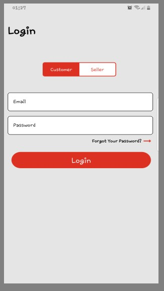
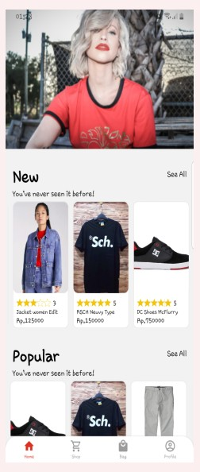
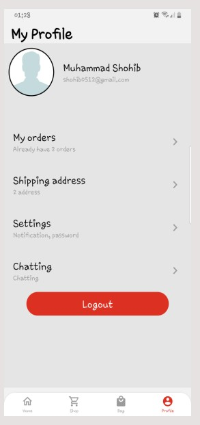
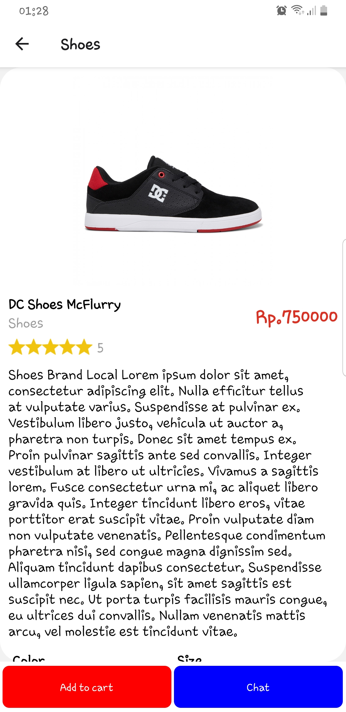
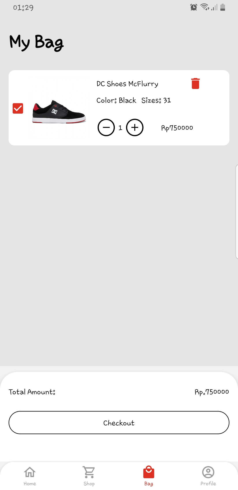
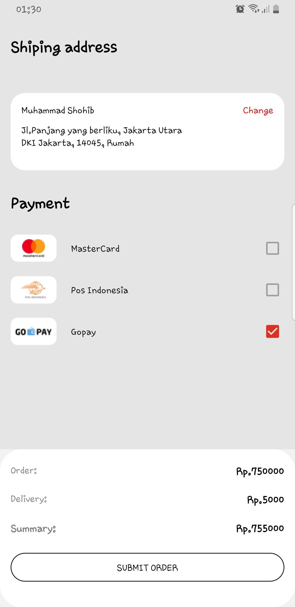

# Blanja Web 

<div align="center">
    
</div>

## Contents

- [Description](#description)
- [Features](#features)
- [Requirements](#requirements-for-development)
- [Installation](#installation-for-development)
- [Screenshoots](#screenshoots)
- [Apk Blanja Mobile](#apk-blanja-mobile)
- [Related Project](#related-project)

## Description

**Blanja Mobile** sebuah e-commerce dimana customer bisa membeli suatu produk yang diinginkan hanya dengan sekali klik. Sebagai seller bisa berjualan tanpa harus memikirkan tempat. Apps ini dibangun menggunakan React Native untuk UI/UX,ExpressJS dan NodeJS untuk Backend.

## Features

- Order product
- History transaction
- Add product (sellers only)
- Edit profile
- Reset Password
- etc

## Requirements for Development

- [`Node Js`](https://nodejs.org/en/)
- [`npm`](https://www.npmjs.com/get-npm) or
- [`yarn`](https://classic.yarnpkg.com/en/docs/install/#debian-stable)
- [`React Native`](https://reactnative.dev/)
- [`Blanja Backend`](https://github.com/Shhb0420/Blanja-API.git)

## Installation for Development

1. Buka terminal / command prompt
2. `git clone https://github.com/Shhb0420/BlanjaApps-withReactNative`
3. Buat folder di direktori dan ketik `npm install` untuk menginstall dependencies
4. Buat file **_.env_** di direktori dengan konten berikut :

```bash
API_URL = "http://host_backend:port_backend"
```

Contoh :

- http://host_backend:port_backend is http://localhost:2005

kamu bisa menulis didalam .env seperti ini :

```bash
API_URL = "http://localhost:2005"
```

5. Sebelum menjalankannya, anda harus mengintall backend terlebih dahulu.
6. `npm start` didalam terminal untuk memulai project.

## Screenshoots

<table>
  <tr>
    <td valign="center"></td>
    <td valign="center"></td>
    <td valign="center"></td>
  </tr>
 </table>

<table>
  <tr>
    <td valign="center"></td>
    <td valign="center"></td>
    <td valign="center"></td>
  </tr>
</table>

## Apk Blanja Mobile

Blanja mobile versi build, silahkan klik link dibawah ini.

<a href="https://drive.google.com/drive/folders/1SGaWYqwP1zDuh-JLYAEyE1P_VMD5-NHS?usp=sharing">
  
</a>

## Related Project

RESTful API untuk web aplikasi ini, Clone repository untuk menjalankannya.

<a href="https://github.com/Shhb0420/Blanja-API">

</a>
